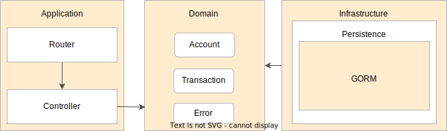

# GoBank

Example of a REST application using the following technologies:

- [Go](https://go.dev/) [Language]
- [Gin Web Framework](https://github.com/gin-gonic/gin) [Router]
- [GORM](https://github.com/go-gorm/gorm) [ORM]
- [Go-MySQL-Driver](https://github.com/go-sql-driver/mysql) [Driver]
- [Testify](https://github.com/stretchr/testify) [Testing-toolkit]
- [Postman](https://www.postman.com/) [API testing tool]
- [k6](https://k6.io/) [API load testing tool]

## Packages overview

## How to run

### Docker / Docker-Compose
You need [Docker](https://docs.docker.com/engine/install/) version 20.10.11 or greater and [Docker Compose](https://docs.docker.com/compose/install/) version 1.29.2 or greater.

     docker-compose up

## Benchmarks